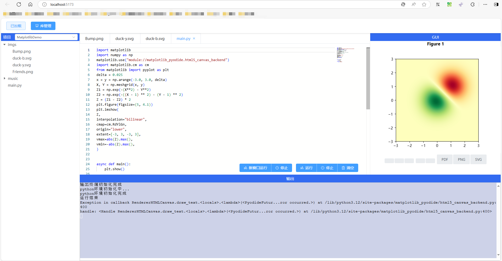
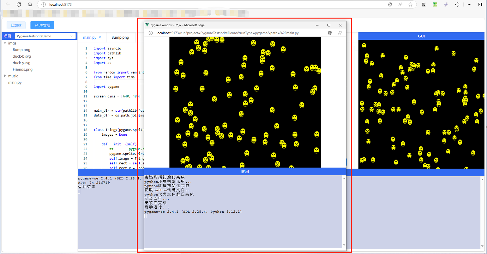
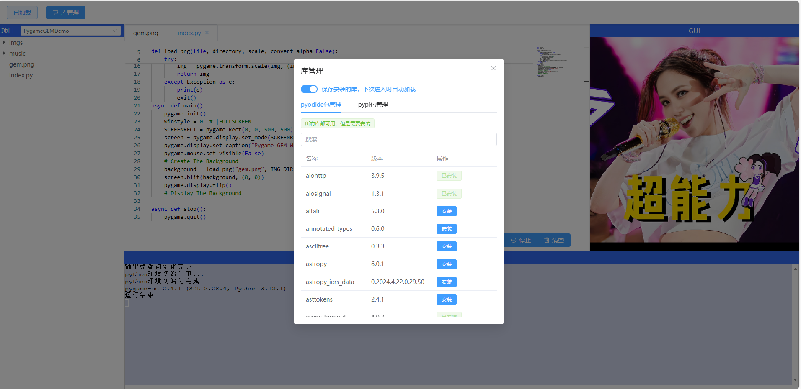

## vue-pyodide-xterm-monaco-editor, an online Python program editor demo developed with Vue 3. With Pyodide, you can run programs like Pygame and Matplotlib in the browser. I hope this demo can help you.

<p>Running Matplotlib, you can see the image output in the left GUI area. I think this is not the best approach.</p>

<br>
<p>Running Pygame, you can use a separate window to run Pygame, which I think is more in line with native behavior.</p>

<br>
<p>Python package management, here you can try various possibilities as much as possible.</p>

<br>

## Environment

The project requires Node.js > 20

## Command Line

```bash
// Clone the project
git clone https://github.com/Mad-hu/vue-pyodide-xterm-monaco-editor.git
cd vue-pyodide-xterm-monaco-editor

// Install dependencies and start the file server
cd fs-server
npm install 
npm run start

// Install dependencies and start the web server
cd ../client
npm install
npm run start
```

## File Structure
- client: Vue 3 web project directory
- fs-server: Node.js file server directory
- python-code: Python project directory loaded in the web project
    - course: Stores all Python projects
    - zip: Stores the compressed packages of the corresponding Python projects
  
## Maintainers

- [Mad-hu](https://github.com/Mad-hu)

## Reference Documentation
- [pyodide.org](https://pyodide.org/en/stable/usage/quickstart.html)

## License

MIT ©